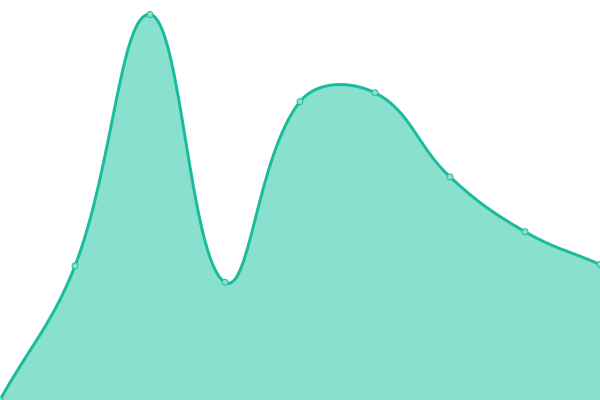

# [Status page](https://status.evelode.com) for [Evelode](https://evelode.com)

This repository contains the open-source uptime monitor and status page for [Evelode](https://evelode.com), powered by [Upptime](https://github.com/upptime/upptime).

## [Live Status](https://status.evelode.com): <!--live status--> **🟩 All systems operational**

<!--start: status pages-->
<!-- This summary is generated by Upptime (https://github.com/upptime/upptime) -->
<!-- Do not edit this manually, your changes will be overwritten -->
<!-- prettier-ignore -->
| URL | Status | History | Response Time | Uptime |
| --- | ------ | ------- | ------------- | ------ |
|  [Evelode](https://evelode.com) | 🟩 Up | [evelode.yml](https://github.com/evelode/status/commits/HEAD/history/evelode.yml) | 

 1195ms
     
 | 

<a href="https://status.evelode.com/history/evelode">100.00%</a>
    

|  Evelode REST API | 🟩 Up | [evelode-rest-api.yml](https://github.com/evelode/status/commits/HEAD/history/evelode-rest-api.yml) | 

 480ms
     
 | 

<a href="https://status.evelode.com/history/evelode-rest-api">100.00%</a>
    

|  TikTok REST API (SFO3) | 🟩 Up | [tik-tok-rest-api-sfo-3.yml](https://github.com/evelode/status/commits/HEAD/history/tik-tok-rest-api-sfo-3.yml) | 

 1922ms
     
 | 

<a href="https://status.evelode.com/history/tik-tok-rest-api-sfo-3">100.00%</a>
    

<!--end: status pages-->

[**Visit our status website →**](https://status.evelode.com)
